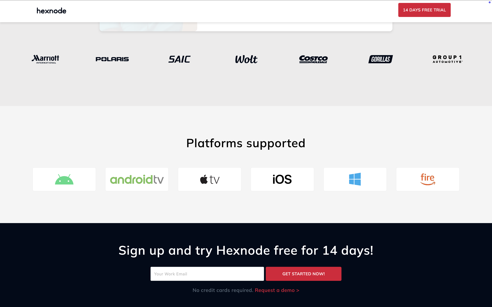

# Project Name

## Features Implemented

- **Tabs**: Created a responsive tab component allowing easy navigation between different sections.
- **Carousel**: Implemented a dynamic carousel for image or content display.
- **Other Components**: Input, Date, Card.

## Approach

### Technologies Used:
- **React.js**: For creating interactive and reusable components.
- **React Router**: For navigation between different views (if applicable).
- **CSS / SCSS**: For styling, with Flexbox and Grid for responsive layouts.
- **JavaScript (ES6+ features)**: For writing logic and handling events.
- **React Hooks**: For managing state and side effects in functional components.
- **Styled-components**: For styling.
- Ensured mobile responsiveness using media queries.
- Focused on modular and reusable components.
- Used semantic HTML for better accessibility.

### Challenges Faced:
- Implementing the tabs and carousel components required additional research. Finding the right libraries for smooth transitions and ensuring cross-browser compatibility took more time than initially anticipated.
- Optimizing the performance of the carousel for faster loading times and smoother animations.

### Additional Notes:
Given more time, I would refine the design and add extra features like accessibility improvements, form validation, and advanced animations.
I’ve ensured that the components are flexible and can be reused in different parts of the application.

## Screenshots

### Tab Component


### Carousel Component


### Input Component


### Card Component


## How to Run the Project

1. **Clone the Repository:**

   ```bash
   git clone [repository-url]

2. **Navigate to the Project Directory:**
   cd [project-folder]

3. **Install Dependencies:**
   npm install or yarn install

4. **Start the Development Server:**
   npm start or yarn start

